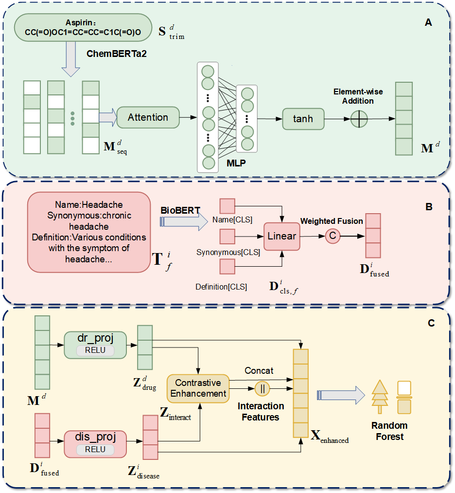

````markdown
# DMAPLM: A Multimodal Pretrained Framework for Computational Drug Repositioning

<p align="center">
  
</p>


---

## Abstract
Drug repositioning, also known as drug repurposing, refers to the identification of new therapeutic indications for existing drugs, providing an efficient and economical alternative to traditional drug research and development. Current computational drug repositioning models often face challenges related to data scarcity, heterogeneity, and limited generalizability, particularly in cold-start scenarios.  
To address these limitations, this study proposes **DMAPLM**, a multimodal pretrained framework for predicting drug–disease associations to enable drug repositioning screening. DMAPLM adopts a lightweight dual-encoder architecture, utilizing **ChemBERTa-2** for molecular encoding of drug SMILES strings and **BioBERT** for semantic encoding of multi-field disease texts (Name, Synonymous, and Definition).  
The framework explicitly aligns drug and disease representations through contrastive learning and employs **attention-weighted pooling** to emphasize informative molecular substructures. Finally, a **Random Forest classifier** is used for association prediction based on the enhanced multimodal features.  

Extensive experiments demonstrate that DMAPLM significantly outperforms six state-of-the-art baseline models, achieving **AUROC = 0.8919** and **AUPR = 0.9116** under five-fold cross-validation, representing an improvement of up to 9%. Moreover, DMAPLM exhibits strong robustness in cold-start scenarios, highlighting its practical value for discovering novel drug–disease relationships. Case studies with molecular docking further confirm the interpretability and biological relevance of our model.

---

## Dataset
The dataset was constructed from **DrugMAP 2.0** (https://idrblab.org/drugmap), a manually curated pharmaceutical database containing experimentally confirmed drug–disease associations.  
Only associations with **“Approved”** status were retained to ensure clinically validated drugs.  
- **Drugs:** Only records with valid SMILES representations were kept.  
- **Diseases:** Three textual fields were extracted — *Disease Name*, *Synonymous*, and *Definition*.  
All processed data are stored under `dataset/appoved/`.

---


### Installation
```bash
conda create -n dmaplm python=3.10.16
conda activate dmaplm
pip install numpy==1.23.1 pandas==2.2.3 scikit-learn==1.1.2 scipy==1.15.2 torch==1.13.1+cu117
````

---

## Run

### Step 1: Generate Drug and Disease Embeddings

```bash
python embedding_generation/drug_emb_gen.py
python embedding_generation/disease_emb_gen.py
```

These scripts will generate multimodal embeddings for drugs and diseases, saved in:

```
dataset/appoved/emb/drug_embeddings/
dataset/appoved/emb/disease_embeddings.npy
```

### Step 2: Run the Main Program

```bash
cd code
python main.py
```

